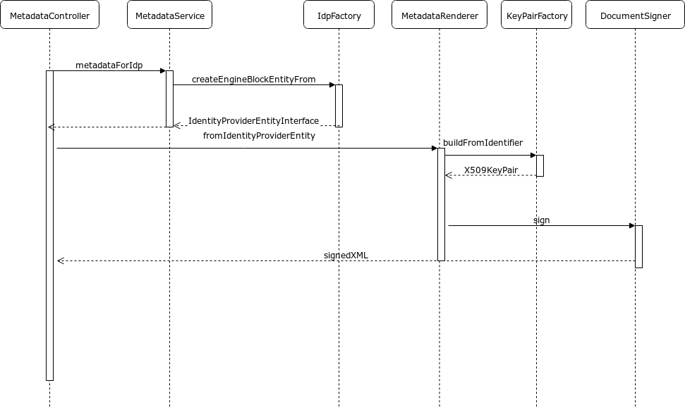

# EngineBlock SAML Metadata

EngineBlock specifies metadata for several entities. All related to its different roles as a SAML Proxy. Next to the
expected SP and IdP metadata, EngineBlock also lists the connected IdP's it is proxying for.

This list of IdP's can also be limited by specifying a SP entity id. The generated IdPs metadata will now be limited to
the IdP's that are connected to that SP. This can be usefull when creating WAYF feature.

Finally, metadata of the EngineBlock stepup authentication endpoint is available.

Details about how to access the endpoints can be found on the EngineBlock home page <sup>[1]</sup>

This documentation is twofold. It describes the reasoning behind the generation of the Metadata as it is currently
implemented (as of EngineBlock release 6.1). But it will also go into technical details. To aid future development teams
in updating or maintaining metadata related features.

## Considerations

Engineblock publishes basic Metadata about itself and its known entities as a convenience, to keep it
a self-contained product that can be connected to remote entities. The metadata is always dynamically
generated and signed on the fly.

However, the main focus of Engineblock is processing logins at runtime. Therefore, we try to
focus the software on this critical task and not integrate too many secondary tasks into the
core login software. Advanced use cases and manipulation and publishing of metadata probably
happens better outside of Engineblock. Where it can also be produced as static files, signed
more securely and not regenerated on every request. It is thus unlikely that we will be making
the built-in metadata much more flexible than it is now.

## Functional description

### Public SAML metadata of the OpenConext IdP Proxy

* Published at: https://engine.vm.openconext.org/authentication/idp/metadata
* Specifies the SSO location and the supported binding (HTTP-Redirect)
* Specifies the signing certificate

### Public SAML metadata of all the OpenConext IdPs

* Published at: https://engine.vm.openconext.org/authentication/proxy/idps-metadata
* Lists every connected IdP connected to the SAML Proxy
* The contact person information for EngineBlock is displayed
* The UIInfo and Organization information for the specific IdP is displayed
* The SSO location for the IdPs are specified at EngineBlocks SSO location. With the addition of a hash, identifying the
  IdP. Example: `https://vm.openconext.org/authentication/idp/single-sign-on/abcdef001234567777778888abcd9999`
* The listing can be limited to a list of IdP's connected to a specified SP. Usefull when an SP wants to build a WAYF of
  their own. Filtering can be applied by specifying the `sp-entity-id` query string. Example:
  `https://engine.vm.openconext.org/authentication/proxy/idps-metadata?sp-entity-id=urn:example.org`.


### Public SAML metadata of the OpenConext SP Proxy

* Published at: https://engine.vm.openconext.org/authentication/sp/metadata
* Specifies the ACS location and the supported binding (HTTP-POST)
* Specifies additional organization information (name, displayname, url)

### Similarities between EngineBlock SAML metadata documents
* Every document starts with a terms of use comment. This value can be configured in the `openconext.termsOfUse` ini
  setting.
* The Metadata documents are signed.
* The Metadata documents are deemed valid for a period of 86400 seconds (1 day).
* The EngineBlock UIInfo elements are generated from the `parameters.yml` config and are translated to English and
Dutch when possible. Mainly English UI Info will be published.
* The logo can be specified using the following `parameters.yml` settings

```
defaults.logo = "/images/logo.png"
defaults.logo_width = 96
defaults.logo_height = 96
```

* Where the `defaults.logo` path should be relative to the public `web` folder.

* The three supported name id formats are not (persistent, transient and unspecified) configurable.

* Contact person data is generated based on the `email.help` ini config value. For the GivenName element, the
`suite_name` is used and for the SurName `Support` is always used.


## Key rollover

Engineblock has support for multiple signing keys in its configuration.

Currently, rollover is supported in the IdP endpoint towards connected SPs. In order to control
and measure adoption of a new key, Engineblock publishes separate sets of metadata with corresponding
SingleSignOn-locations which contain the key ID in that metadata file. If an SP consumes the metadata,
they will load both the new key and the SSO location with the ID. When logging in, EB received the
desired key ID and will respond to that SP with the corresponding key. This allows for a key rollover
to be performed gradually, where SPs that load the new metadata will immediately be only using the
new key, and the Engineblock operator can see from the authentication log which SPs still use the
old key.

There needs to be a key named "default". This will be used towards IdPs (authnrequest signing),
towards the Stepup IdP (if used) and for SPs that do not specify a specific key ID in the single
sign on location.

Engineblock does *not* currently have support for the classic key rollover scenario where multiple
keys are published in its metadata and remote entities consume this, after a while the new key
will be set active and the old key removed from metadata.

## Technical design
The metadata endpoints are regular controller actions in the Symfony application (as they where prior to the EB 6.1
changes). The routes are configured in `src/OpenConext/EngineBlockBundle/Resources/config/routing/metadata.yml`

The diagram shows which classes are responsible for creating the metadata.



Things get a little more interesting when the XML documents are created.

Rendering of the XML documents is performed by using the Twig template engine.

### Twig implementation details
Three xml templates have been created. Each including partials when using components that are reused between the three
different SAML Metadata documents. See the functional specification for a listing of the shared elements.

The templates are rendered based on a `IdentityProviderEntityInterface` or an SP counterpart when rendering SP metadata.
The rendered template is then signed by the `MetadataRenderer` using its `DocumentSigner`

The signed XML is rendered as a Symfony response with an XML content type.

### Decorators representing SAML entities
The metadata that is generated is based on the EngineBlock SP/IdP Entities. These entities where loaded from the
`sso_provider_roles_eb5` table. Meaning that in order for EngineBlock to function, a Manage metadata push was required.

As of EngineBlock 6.1, EngineBlock no longer depends on the roles table for metadata generation. As specified in the
functional description, all required data is either loaded from the EngineBlock ini configuration, or is hard-coded into
the application.

EngineBlock uses IdP and SP entities throughout the application. The entities are used for different purposes. For
example when publishing metadata. An IdP entity an be used in the context of EngineBlock in its role of the proxy IdP.
But IdP entities are also represented in the IdPs metadata document. Both IdP entites behave slightly different. In
order to prevent a lot of controll logic to test how the entity should be handled, we used the decorator pattern.
Decorators for different SP/IdP roles have been created.

A detailed overview about the specific implementation of the pattern can be found here <sup>[2]</sup>

### Key rollover
The keys used for signing/encryption are configured in the parameters.yml. Calling the metadata with a key identifier
will cause the metadata to be updated, using the specified key to sign the document and put it as the signing
KeyDescriptor. Which is the whole idea of the key rollover pricible.

When the SP or IdP entity is decorated, the key identifier that was passed to the controller action is used to load the
appropriate key pair (using the key pair factory). This factory reads the keys from the filesystem location configured
in the parameters.yml. And creates an X509 keypair.

This keypair is loaded on the decorator and used to show the correct certificate value in the XML metdata.

### Tests

The metadata generation is tested on multiple levels.

**Unit tests**
All business logic touching on Metadata generation has been unit tested.

**Functional tests**
A behat test feature was created, covering the most important aspects of the metadata generation.

The scenarios can be found in: `src/OpenConext/EngineBlockFunctionalTestingBundle/Features/Metadata.feature`

**Visual regression / smoke tests**
No visual regression or smoke tests have been created


# References
[1]: https://engine.vm.openconext.org/
[2]: metadata_decorators.md
