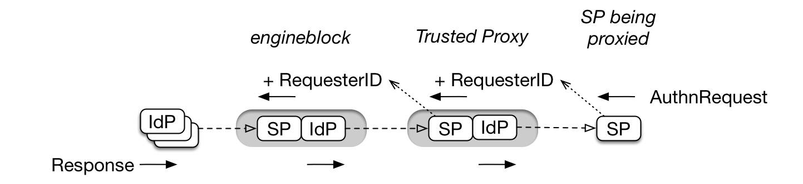

# Trusted Proxy in EngineBlock

A "trusted proxy" in OpenConext is a SAML SP that uses engineblock as its IdP. The difference between a normal SP and a SP is that is a trusted proxy is that the latter is allowed to 'impersonate' other service providers. This allows a SP proxy to be connected to engineblock while using the ACL, ARP, consent and pseudonymisation functions of engineblock.

## Enabling

Trusted proxy is enabled per SP. To enable trusted proxy behaviour for a SP, set "coin:trusted_proxy" and "redirect.sign" to true for the configuration of the SP. The default for this setting is false. Note that after enabling "redirect.sign" all AuthnRequests must be signed.

## EngineBlock Trusted Proxy behaviour

From now on we will call the SP that is the trusted proxy "trusted proxy" or "TP" and the SP being proxied, the "end-SP".

EngineBlock will only enable trusted proxy processing for a SAML AuthnRequest that it receives from a TP when all of the following conditions are met:
* Both "coin:trusted_proxy" and "redirect.sign" are set in the TP Entity configuration in EngineBlock. This TP is identified by the value of the /AuthnRequest/Issuer element in the SAML AuthnRequest.
* The AuthnRequest has a valid signature.
* The SAML AuthnRequest contains at least one /AuthnRequest/Scoping/RequesterID element.

### Trusted proxy processing

The image below shows a proxy (a trusted proxy) that is connected to EngineBlock:
* The __trusted proxy SP__ is an TP that sends an AuthnRequest to EngineBlock.
* The __SP being proxied__ is the end-SP behind the trusted proxy.



When processing a AuthnRequest from a trusted proxy engineblock performs some actions as if the end-SP sent the AuthnRequest directly. This is what differentiates trusted proxy processing from the normal processing in engineblock, which is also proxy aware but will never allow impersonation of another SP or reveal pseudonyms of another SP. For trusted proxies engineblock:
* Generates the NameID for the end-SP being proxied. This makes the persistent NameID (which is a pseudonym targeted at a SP) of the end-SP available to the trusted proxy to send on to the end-SP (in the Subject and/or in eduPersonTargetId if present in the ARP).
* The ARP of the end-SP is applied and the ARP of the TP is applied (if set).
* Consent is asked and remembered for the end-SP.
* The attribute manipulations of the end-SP and the TP being proxied are run.
* Adds an extra attribute `urn:mace:surf.nl:attribute-def:internal-collabPersonId` (single valued, string) to the released attributes, targeted at the TP which the TP can use to identify the user.

### Trusted proxy processing details

The SAML AuthnRequest below is en example of the AuthnRequest that a trusted proxy sends to engineblock. In this request:
* The trusted proxy has an entityID of "https://trusted-proxy.example.com/metadata". This is the value of the `/AuthnRequest/Issuer` element in the SAML AuthnRequest to engineblock.
* The end-SP has en entityID of "https://sp-being-proxied.example.net/metadata". EngineBlock uses the value of the _last_ `/AuthnRequest/Scoping/RequesterID` element in the SAML AuthnRequest to engineblock. This means that a trusted proxy must ensure that its RequesterID element is the last RequesterID in the list.

```xml
<samlp:AuthnRequest xmlns:samlp="urn:oasis:names:tc:SAML:2.0:protocol"
                    xmlns:saml="urn:oasis:names:tc:SAML:2.0:assertion"
                    ID="_7a531831ec3d4b26f594d5bfcd676d6295d8ceb4ef5b8742c8b6f39a2a11"
                    Version="2.0"
                    IssueInstant="2017-07-27T14:18:39Z"
                    Destination="https://eb.example.org/authentication/idp/single-sign-on"
                    AssertionConsumerServiceURL="https://trusted-proxy.example.com/consume-assertion"
                    ProtocolBinding="urn:oasis:names:tc:SAML:2.0:bindings:HTTP-POST">
    <saml:Issuer>https://trusted-proxy.example.com/metadata</saml:Issuer>
    <samlp:Scoping ProxyCount="10">
        <samlp:RequesterID>https://sp-being-proxied.example.net/metadata</samlp:RequesterID>
    </samlp:Scoping>
</samlp:AuthnRequest>
```

Processing of the request:
* Both the trusted proxy and the end-SP being proxied must be known to engineblock (= configured as SP entities in Manage)
* Both the trusted proxy and the end-SP being proxied must have the same workflow state

* The ACL of both the trusted proxy and the end-SP are verified. Only IdPs are allowed access to both SPs are allowed to login
* The ARPs of both the trusted proxy and the end-SP being proxied are applied. Only attributes and attribute values that are allowed by both ARP are included in the response
* The attribute manipulations (AMs) of both the trusted proxy and the end-SP are run. The AMs of the trusted proxy are run first.
* Stepup-invocation is done if configured for the end-SP.
* The PDP is called for the end-SP being proxied only.

What the trusted proxy should do:
* The trusted proxy is expected to verify the SPs it connects and authenticates on behalf on.
* The trusted proxy must ensure to remove the internal-collabPersonId from the released attributes to the end-SP, as this is only intended for communication between  engineblock and the trusted proxy. 
